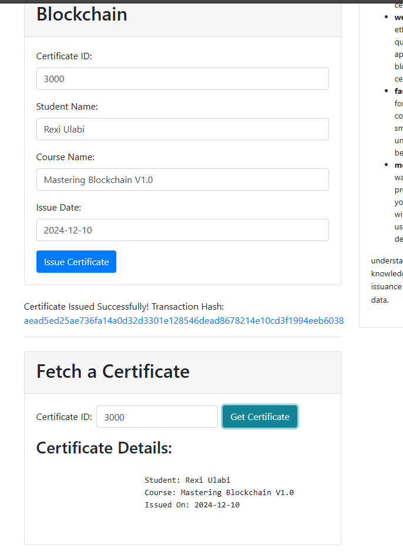
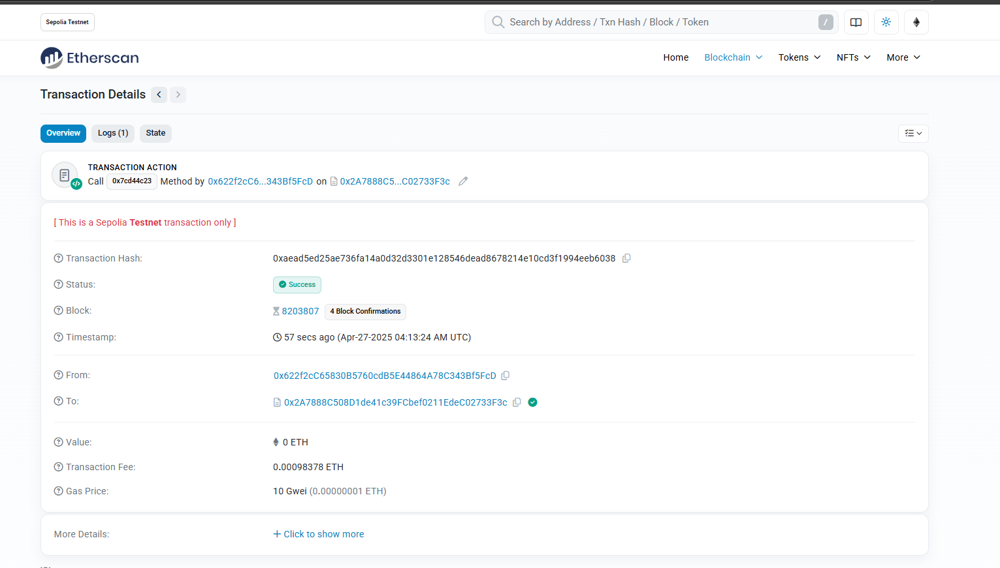

# web3-course-certificate-issuer

This project provides a decentralized certificate issuance system built on the Ethereum blockchain. Using smart contracts, the application allows institutions to issue, verify, and track course certificates securely and immutably.

## Medium
https://medium.com/scriptkiddiez/demystify-smart-contracts-your-gateway-to-the-next-gen-tech-bc012be12753
## Features

- **Issue Certificates**: Institutions can issue course certificates using Ethereum-based smart contracts.
- **Fetch Certificates**: Users can retrieve certificate details through the blockchain.
- **Immutable & Transparent**: Every certificate issued is stored on the blockchain, ensuring its authenticity and immutability.
- **Blockchain Integration**: Built on Ethereum and smart contracts for transparency and security.

## Prerequisites

Before running the project, make sure you have the following:

- **Metamask Account**: A cryptocurrency wallet used to interact with Ethereum. You will need a Metamask account connected to the Sepolia test network to interact with this app.
- **Ethereum Test Network (Sepolia)**: A test network for deploying contracts without using real ether.
- **Remix IDE**: A web-based IDE for writing, deploying, and managing smart contracts.
- **Faucet**: A service to get free test ether for testing.

---

## Configuration

Before running the application, you'll need to configure a few details (after you clone this repo you will see file name as config.py under root folder). These configurations are essential for connecting to the Ethereum network and interacting with the smart contract.

### 1. Set Up `config.py`

Create a file named `config.py` in your project root directory and populate it with the following details:

```python
# config.py

# Infura URL for connecting to Ethereum network
INFURA_URL = "https://sepolia.infura.io/v3/YOUR_INFURA_PROJECT_ID"  # Replace with your Infura URL

# Private Key (Make sure to keep it secure and never push it to public repositories)
PRIVATE_KEY = "YOUR_PRIVATE_KEY"  # Replace with your private key

# Ethereum Account Address (Usually from MetaMask or any Ethereum wallet)
ACCOUNT_ADDRESS = "YOUR_ACCOUNT_ADDRESS"  # Replace with your Ethereum account address

# Contract Details (to be filled in with actual data)
CONTRACT_ADDRESS = "YOUR_CONTRACT_ADDRESS"  # Replace with your smart contract address
CONTRACT_ABI = '''[ ]'''  # Replace with your contract's ABI (Application Binary Interface)
```

### 2. Replace Placeholder Values
- **INFURA_URL**: Replace `YOUR_INFURA_PROJECT_ID` with the actual URL from your Infura project. If you don’t have one, sign up at [Infura](https://infura.io/).
  
- **PRIVATE_KEY**: Add your private key here (from your Ethereum wallet or MetaMask). **Be careful not to expose your private key publicly**. It should never be pushed to public repositories.
  
- **ACCOUNT_ADDRESS**: This is your Ethereum account address, typically provided by MetaMask or another Ethereum wallet.

- **CONTRACT_ADDRESS**: After deploying your smart contract, replace `YOUR_CONTRACT_ADDRESS` with the contract's address.

- **CONTRACT_ABI**: Replace the placeholder `[]` with the actual ABI of your deployed smart contract. You can obtain this from Remix or the tool you used to deploy your contract.

### 3. Keep Your Private Key Secure
It’s very important to ensure that your private key remains secure. **Never expose it publicly** or push it to a public GitHub repository. Consider using environment variables or a secure vault to store sensitive information in production environments.

---
## Project Setup

### Clone the Repository

To get started, clone the repository to your local machine:

```bash
git clone https://github.com/yourusername/course-certificates-ethereum.git
cd course-certificates-ethereum
```

### Install Dependencies

For the backend (Flask), you'll need Python and the required libraries. You can install them by running:

```bash
pip install -r requirements.txt
```

For the frontend, the project uses standard HTML and Bootstrap. If you anticipate expanding the frontend or using a build process, you might need Node.js.


### Configure Metamask & Ethereum Network

1. **Install Metamask**: Add the Metamask extension to your browser.
2. **Set up Sepolia Test Network**: In Metamask, go to settings and add Sepolia as a test network.
3. **Obtain Test Ether**: Use a Sepolia faucet (like [Sepolia Faucet](https://faucet.sepolia.org/)) to get free ether for testing.

### Set up Smart Contracts in Remix

1. Go to [Remix IDE](https://remix.ethereum.org/).
2. Write and deploy the smart contract that will manage certificate issuance and verification.
(you can copy from this repo smartContract/certificate.sol)

3. Deploy the contract to the Sepolia test network. Make sure to note the contract address.


### Run the Application

1. Start the Flask backend server:

```bash
python app.py
```

2. Open the `index.html` file in your browser to interact with the certificate issuer app. You'll need to configure the application with your smart contract's address.

## How It Works

### Issue a Certificate

1. The institution enters the certificate details such as certificate ID, student name, course name, and issue date.
2. The application sends this data to a smart contract deployed on Ethereum.
3. A transaction is created and recorded on the blockchain, ensuring immutability and transparency.
4. The transaction hash is displayed upon successful issuance.

### Fetch a Certificate

1. Users enter a certificate ID to fetch certificate details.
2. The application communicates with the blockchain and retrieves the relevant data.
3. The certificate details are displayed to the user.

### Blockchain Interaction

The application interacts with the Ethereum blockchain using the Web3.js library. Metamask is used for managing user accounts, connecting to the blockchain, and signing transactions securely. The Flask backend provides an API to facilitate these interactions.

## Technologies Used

- **Solidity**: For writing the smart contract.
- **Remix IDE**: For developing and deploying the contract.
- **Web3.js**: JavaScript library for interacting with the Ethereum blockchain.
- **Flask**: Python web framework used for the backend of the application.
- **HTML/CSS/Bootstrap**: Frontend technologies used for the user interface.
- **Ethereum**: The underlying blockchain platform.

## Deployment

To deploy this project to a production server, follow these steps:

1. **Set up a server**: You'll need a server (e.g., a cloud instance from AWS, Google Cloud, or DigitalOcean) with Python and Node.js (if needed) installed.
2. **Deploy the smart contract**: Ensure your smart contract is deployed to the desired Ethereum network (Sepolia for testing, or Mainnet for production).
3. **Configure the application**:
    - Update the application's configuration to point to your deployed smart contract's address and the correct Ethereum network. This might involve setting environment variables or modifying a configuration file.
    - If you have a frontend build process, build your frontend and include it in your Flask application's static files.
4. **Set up a web server**: Use a production-ready web server (like Nginx or Apache) to serve your Flask application. A common approach is to use a WSGI server (like Gunicorn) to interface between Flask and the web server.
5. **Configure DNS**: Point your domain name to the server's IP address.
6. **Secure your application**: Implement security best practices, such as:
    - Using HTTPS (get an SSL certificate).
    - Protecting your server with a firewall.
    - Keeping your software up to date.

## Example Workflow

### Issue a Certificate

1. Go to the "Issue Certificate" section in the web application.
2. Enter the required certificate details: certificate ID, student name, course name, and issue date.
3. Click the "Issue Certificate" button.
4. Metamask will prompt you to confirm the transaction.

### Fetch a Certificate

1. Go to the "Fetch Certificate" section in the web application.
2. Enter the certificate ID and click on the "Get Certificate" button.
3. The application will fetch the certificate data from the blockchain and display it.

## Screenshots

### Main Overview


### Issuer and Fetch Function



### Etherscan Block Hash Issued



## Contributing

Contributions to the project are welcome! If you'd like to contribute:

1. Fork the repository.
2. Create a new branch (`git checkout -b feature-branch`).
3. Make your changes.
4. Commit your changes (`git commit -am 'Add new feature'`).
5. Push to your branch (`git push origin feature-branch`).
6. Create a pull request.

## License

This project is licensed under the MIT License - see the [LICENSE](LICENSE) file for details.

## Acknowledgements

- **Metamask** for simplifying blockchain transactions.
- **Remix IDE** for providing an easy-to-use environment for Solidity development.
- **Ethereum** for offering a decentralized platform for smart contracts.
- **Flask** for powering the backend of the app.

## Contact

If you have any questions or need help with the project, feel free to open an issue in the repository or contact me via [GitHub](https://github.com/ndoteddy).


